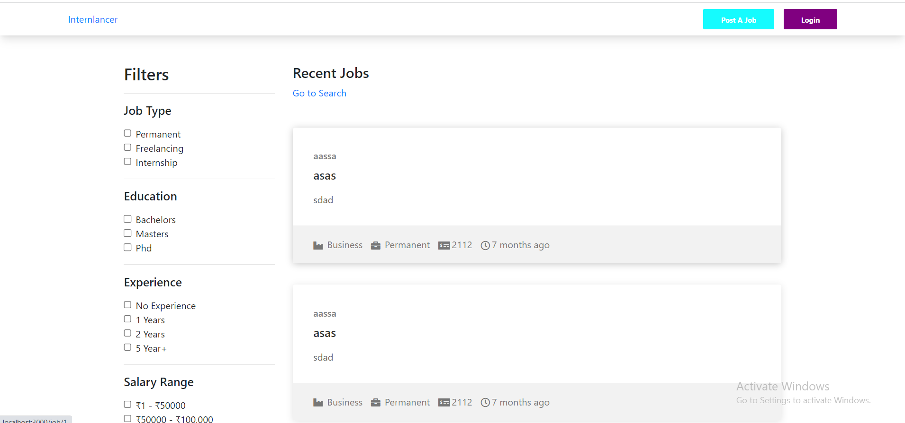
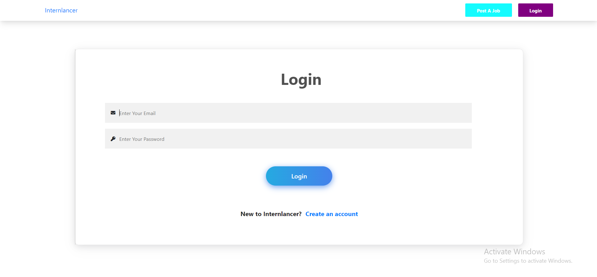
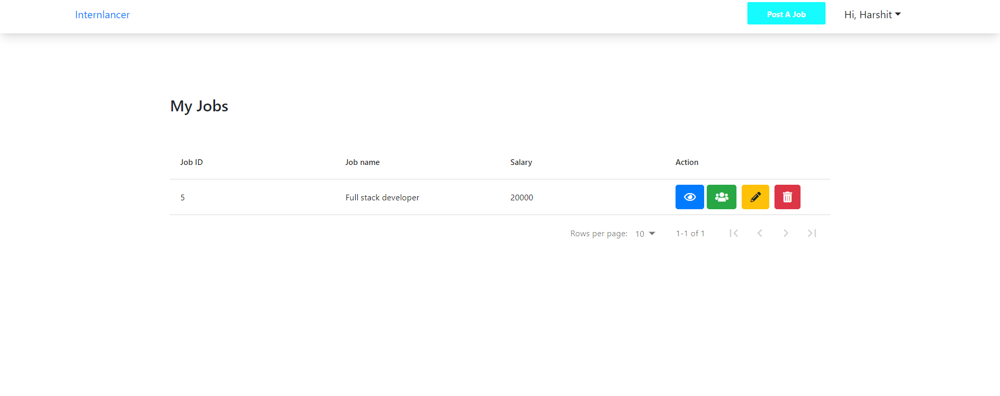
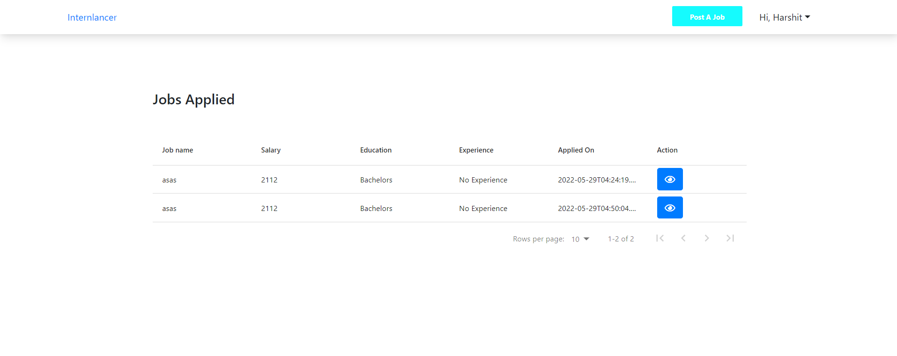
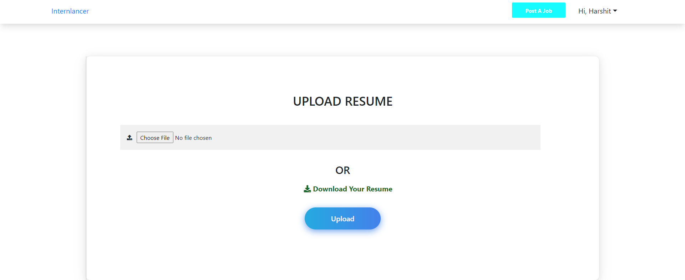
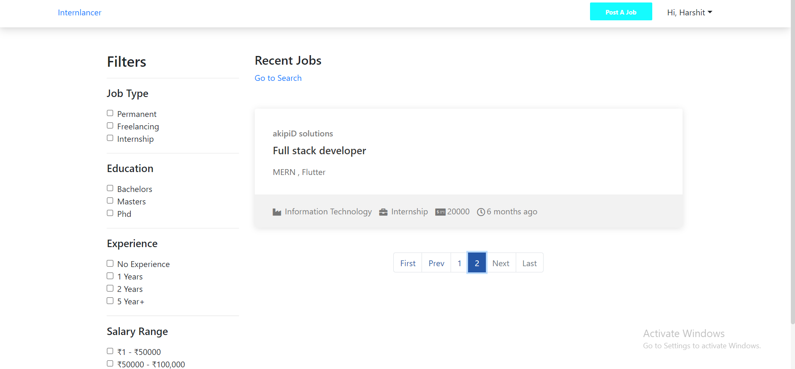
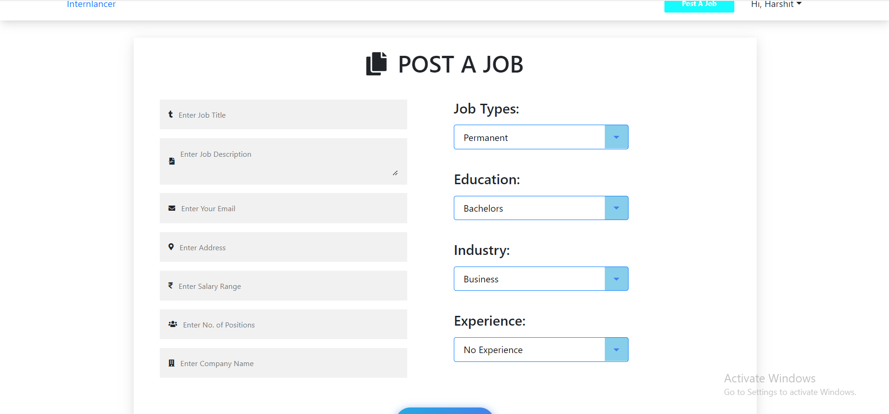

# Internlancer

A Full Stack Web Application made using Next.js and Django where users can post jobs and apply for jobs.We have used postgresql as a database and django rest framework for the backend. Next.js has been used as a frontend here. Users can upload their resume and apply for the job. They can also post their own job. Users can search for the jobs as well as apply filters in the job too.

# Screenshots of the project

